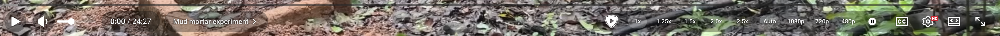

# YouTube Panel Quick Controls

A tiny Chrome extension for the very serious business of watching YouTube while Codex is working.

YouTube's original player UX has opinions. Some of them limp. This puts the controls you actually touch where they are easier to reach, because in practice this is just more convenient.

- Adds quick speed buttons: `1x`, `1.25x`, `1.5x`, `2.0x`, `2.5x`.
- Adds separate quality buttons on the right side, from `480p` and up.
- Replaces the pop-up volume control with an always-visible horizontal slider.

## Install

1. Open `chrome://extensions`.
2. Enable `Developer mode`.
3. Click `Load unpacked`.
4. Select this repository folder.
5. Open or reload YouTube.

## Files

- `manifest.json` - extension metadata.
- `content.js` - YouTube player control logic.
- `styles.css` - panel and horizontal volume slider styling.
